# Solucio t03 FTP

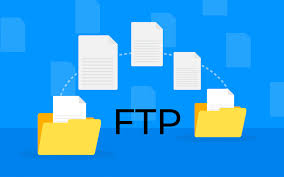

## 1. instalacio del servei
``` bash
sudo apt install vsdtpd
```

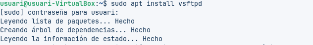

## 2 Fer una copia del archiu original

Aquest comandament crea una còpia de seguretat del fitxer de configuració original de *vsftpd*.  
Això permet restaurar la configuració anterior en cas que apareguin errors després de fer canvis.

``` bash
cp /etc/vsftpd.conf /etc/vsftpd.bak
```


## 3 Archiu de configuracio

Habilitem l’opció `anonymous_enable=yes` dins del fitxer de configuració de **vsftpd** per permetre l'accés anònim al servidor FTP.  
Un cop modificat el fitxer, reiniciem el servei perquè els canvis tinguin efecte.

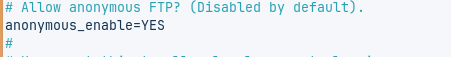

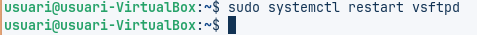

## 4. FTP Anonim
Comprovar que la carpeta "/srv/ftp" s'ha creat, i quins permisos te
Per punlicar harxius, ser descargats, cal copiarlos en acesta carpeta òbiament es pot crar una estructura de carpeta dins.
``` bash
tree  /rsv/
```
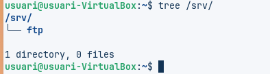

## 5.conexio al client
### 1 Instalar el ftp en el client 

``` bash
sudo apt install vsdtpd
```


ens conectem emb els usuarirs que volem

``` bash
sudo apt ftp 192.168.56.101
```
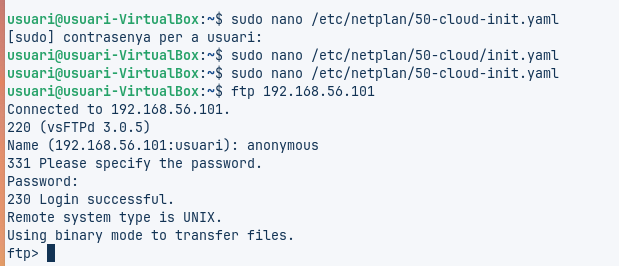

## 6 ftp autinticat

Configurem la via d'accés FTP dels usuaris, que hauran d’accedir amb les seves pròpies credencials per iniciar sessió al servei.

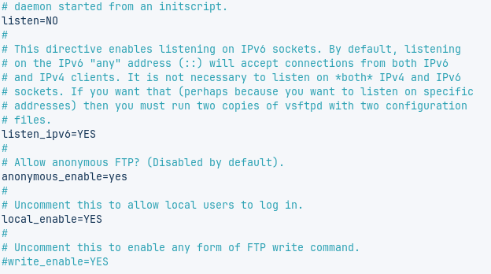

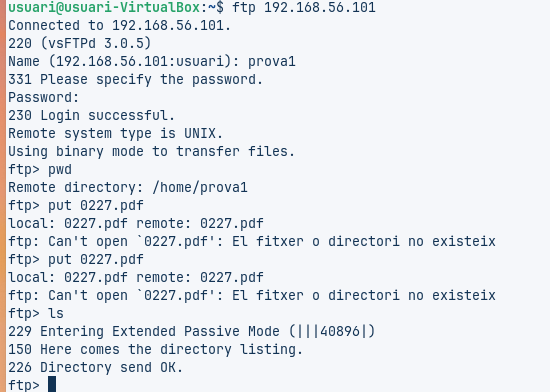

## 7 engavinat dels usuaris


Serveix perquè els usuaris locals no puguin sortir de la seva carpeta quan es connecten pel servei FTP, mantenint-los confinats dins del seu directori personal.

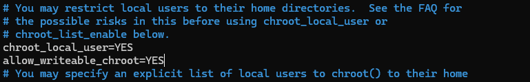

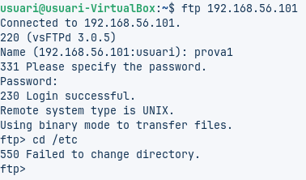

## 8 Aspectes de seguretat

uest servidor FTP continua utilitzant transmissions insegures.  
Amb qualsevol analitzador de trànsit és possible capturar els datagrames que es transmeten per la xarxa.

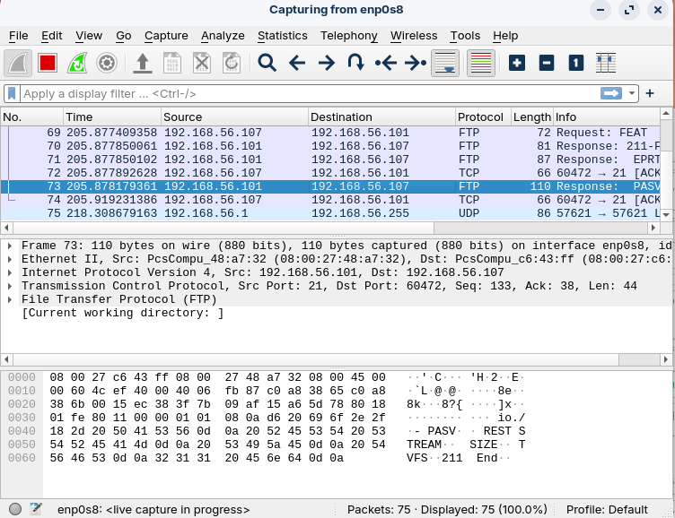

## 9 FTP segur
L’FTP segur s’aconsegueix utilitzant TLS (FTPS) per evitar problemes de seguretat.
Per a l’ús a Internet és recomanable un certificat signat per una autoritat certificadora (CA), tot i que per a proves es pot fer servir un certificat autosignat del servidor.
Existeixen dos modes de FTPS:

Implícit (obsolet), que utilitza habitualment el port 990.

Explícit, que utilitza el port 21 i inicia TLS un cop establerta la connexió.

Quan s’instal·la un servei que utilitza TLS, el sistema operatiu sovint genera automàticament unes claus autosignades (anomenades “snake‑oil”), que només serveixen per a proves i no són segures per a producció.

També indica que s’ha de comprovar si existeix la clau privada del certificat, que habitualment es troba al directori:
``` bash
/etc/ssl/private
```

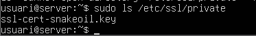

Editem el archiu de configuracio " /etc/vsftpd.conf" i afegim les seguents lines de codi

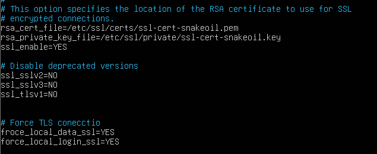

