# T04 Windows server

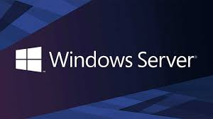

## 1 Instalacio del servidor
Molt im portant selecionar l'opcio de eskip

### 1.2 selecionar la llengua , 
selcionarem idioma de instalacio ingles,
pro la altre opcio Spanish

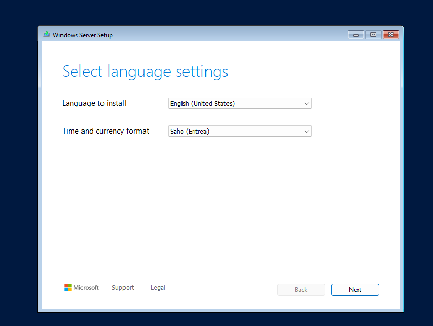

### 1.3 Idioma del teclat
deixem Spanish per defcte

### 1.4 intala windows server
Instalem windows server

### 1.5 Seleciona la imtge
MOLT IMPORTANT, selecionar la imatge amb entorn gràfic,
i haceptem les lisencies

### 1.6 Selcionar el lloc de instalacio
Selecionar el disc on voleu instalar Windows server

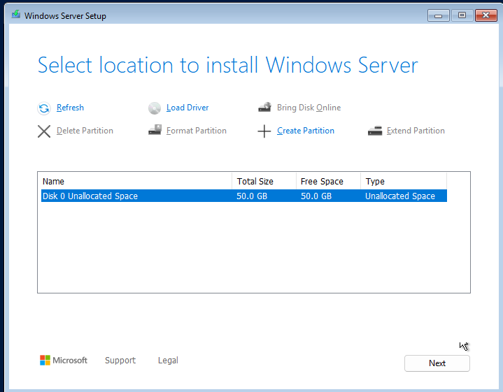

## final de la instalacio
Domes cal esperar a que es completi la instalacio

## 2 configuracio del servidor
### 2.1 Contrasenya dal administrador

Afeigim una contrasenya al nostra usuari de adiminstrador, A de ser complexa 

### 2.2 canviar el nom 
Es important cambiar el nom del equip per mes eficiencia

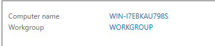

Li donem ha change

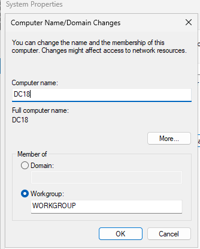

### 2.3 Configuracio de xarxa
El controlador de domini s' apuntar a ell mateix, 
utlitzarem la ip (127.0.0.1)

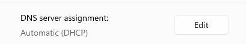

### 2.4 Intalacio del Rol Domine service
Lo primer que ferem es entrar a la part de Manager, I entrar hon diu add Roles and features

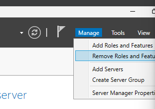

Segint d'l apartatde installation Type

Next..

Permet Insta-lar roles de forma centrelitzada als diferents servidors del domini. 

Next...

Next...

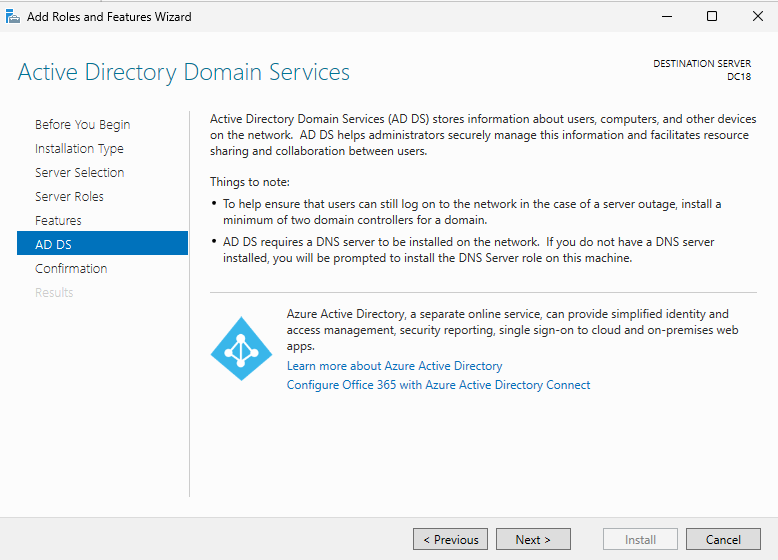

Confirmation...

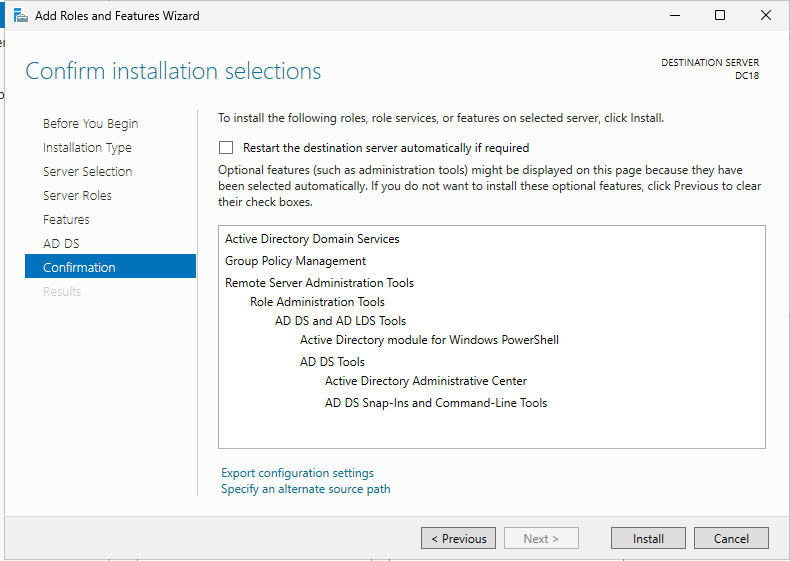

INSTALL..

## 2.5 Promoció a domain controller

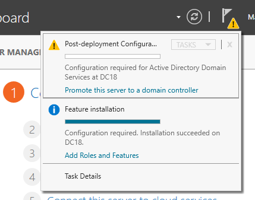

Entrem on diu Promote this server to a domain controller

I selecionem el tipus de instalacio que volem fer,
Ens pregunta si volem afegir a undomini que ja existeix,

Next...

El nivell funcional de bosc i domini 

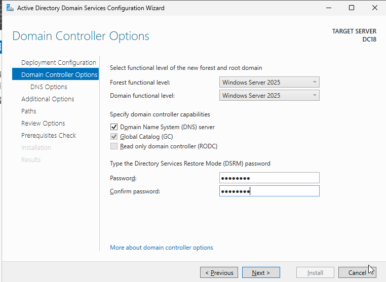

next...

Com utilitza DNS i no detecta cap operatiu que contingui el domini triat, ens avisa i procedirà a instal·lar aquest rol al DC. Cliquem directament a Next

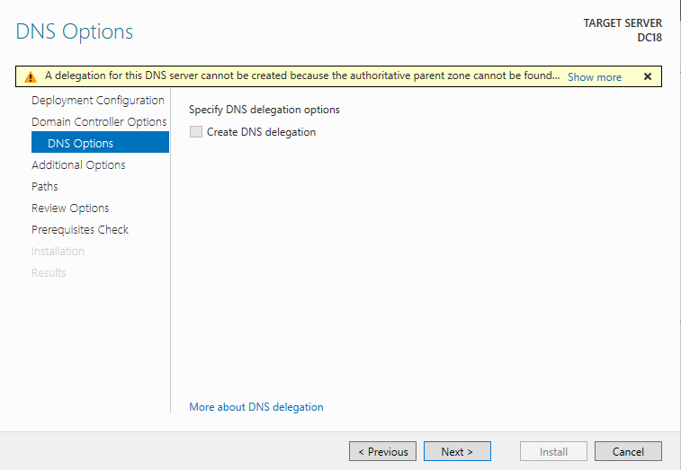

next...

Per compatibilitat amb sistemes que encara usen NetBIOS (Samba3, XP en grup de treball...) assigna automàticament un nom NetBIOS al domini.

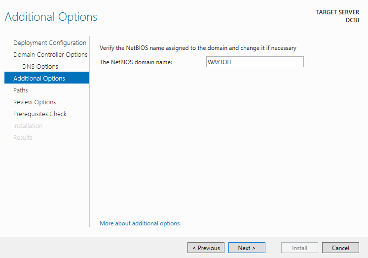

next....

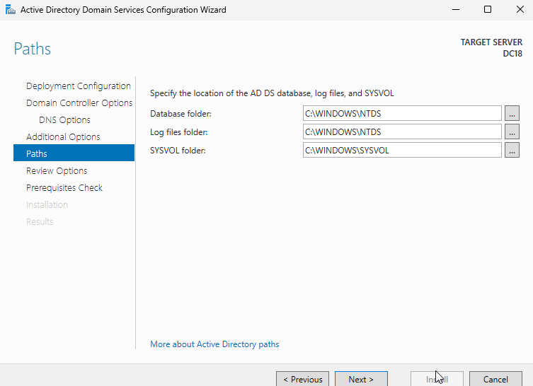

next..

Ens mostra un resum de les configuracions triades i dóna l’opció de crear un script PowerShell amb elles. Això és molt útil per replicar configuracions.

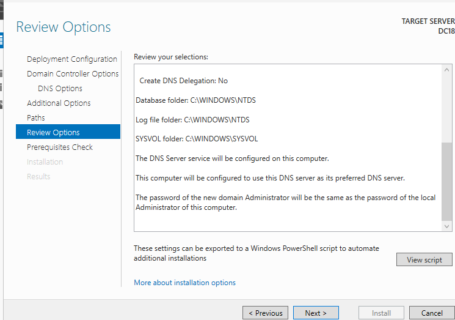

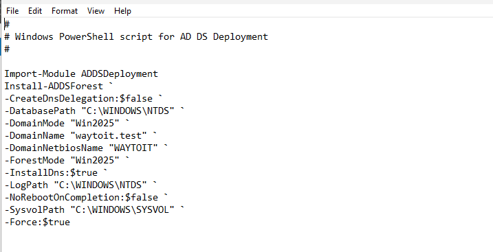

Instala..

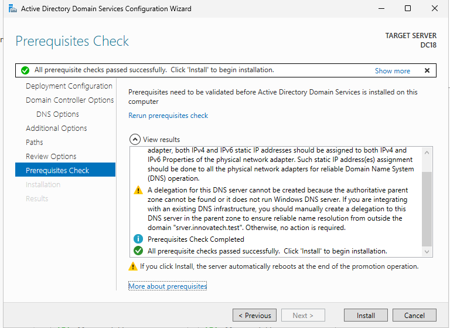

Un cop acabada la instal·lació, la màquina s’ha de reiniciar i ens demanarà loguejar-nos com Administrator del domini

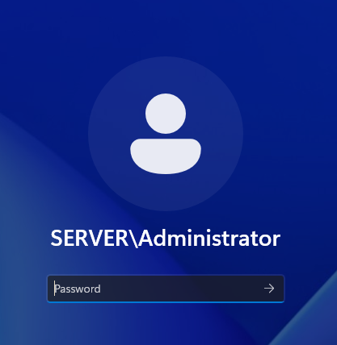

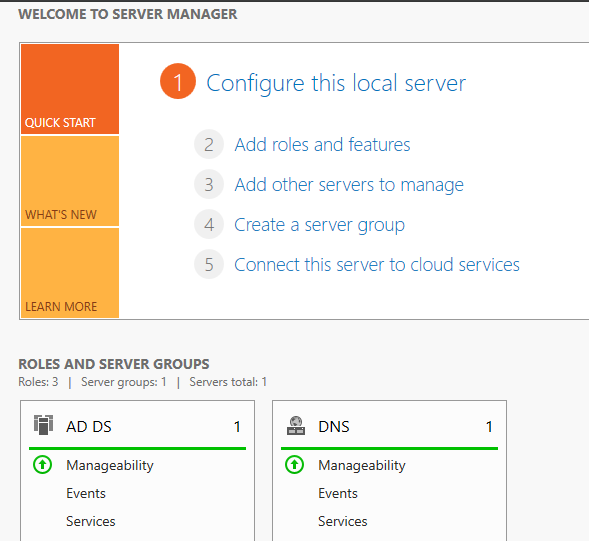

## 2.6 Zona horaria 

 Cal ajustar la zona horària perquè per defecte posa horari Costa Oest d’Estats Units.
 Un cop fet això, ajusteau l’hora correcta.

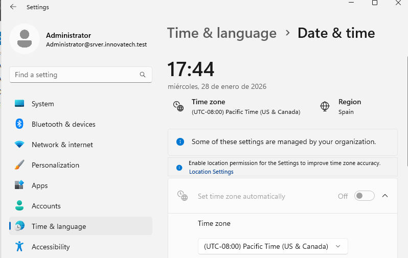

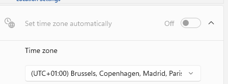

## 2.7 Configuracio dns 

l nostre controlador de domini fa de servidor DNS, per tant, pot fer consultes directes a Internet.
Per millorar velocitat i reduir quantitat de consultes, configurarem un reenviador per totes les adreces de Internet.

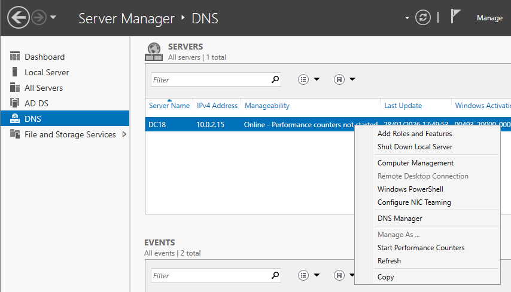

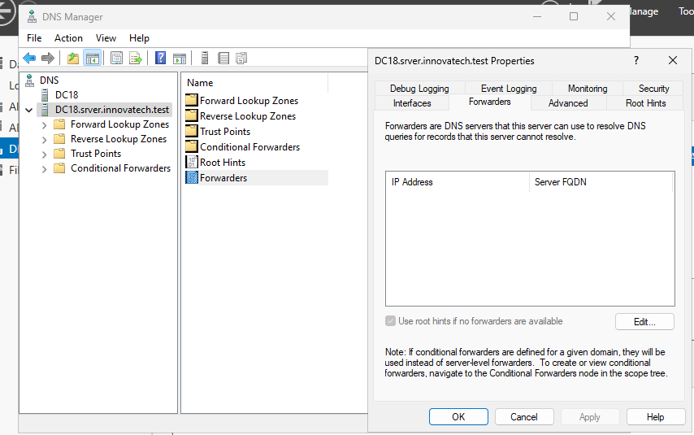

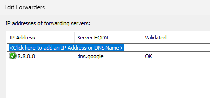

## 2.8 Eines de gesto
Per gestionar el nostre servidor Windows Server disposem de diverses opcions:

Server Manager

Windows Admin Center

PowerShell

### Server Manager

Pantalla de gestió central, permet visualitzar mètriques, accedir a les eines.
En cas de tenir diversos servidors dins el domini, es poden administrar directament des d’una consola de Server Manager única.
 És l’eina amb la que treballarem nosaltres habitualment.

 

 ### Windows Admin Center
Nova eina de Microsoft per gestionar elements del Directori Actiu des d’un navegador.
Es pot utilitzar tant des del servidor com des d’un client.

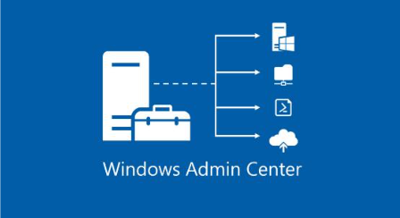

 Abans de res, cal baixar-lo a l’equip des del qual vulguis administrar.
Es tracta d’un paquet msi que s’haurà d’instal·lar i després s’executarà en el navegador.

### powershell
Totes les accions relatives tant al servidor com a la gestió del Directori Actiu es poden fer mitjançant cmd-lets de PowerShell.
En un client es pot instal·lar el mòdul de PowerShell per Active Directory per fer la gestió remota.
El principal avantatge es que permet automatitzar tasques i gestions mitjançant scripts.”
Si quieres que siga, que compile todo en un solo documento o que lo traduzca, ¡te lo preparo encantado!