# T04 Windows server

## 1 Instalacio del servidor
Molt im portant selecionar l'opcio de eskip

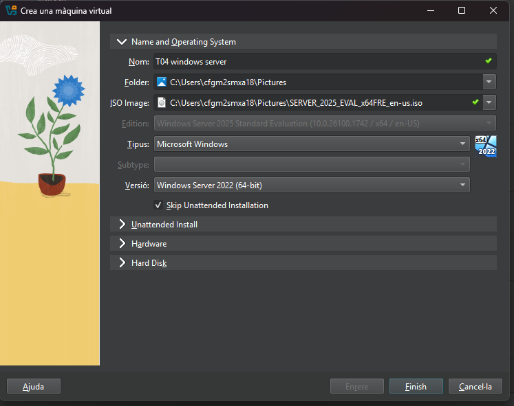

### 1.2 selecionar la llengua , 
selcionarem idioma de instalacio ingles,
pro la altre opcio Spanish

### 1.3 Idioma del teclat
deixem Spanish per defcte

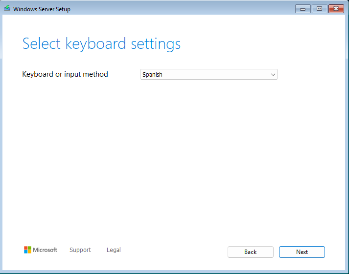

### 1.4 intala windows server
Instalem windows server

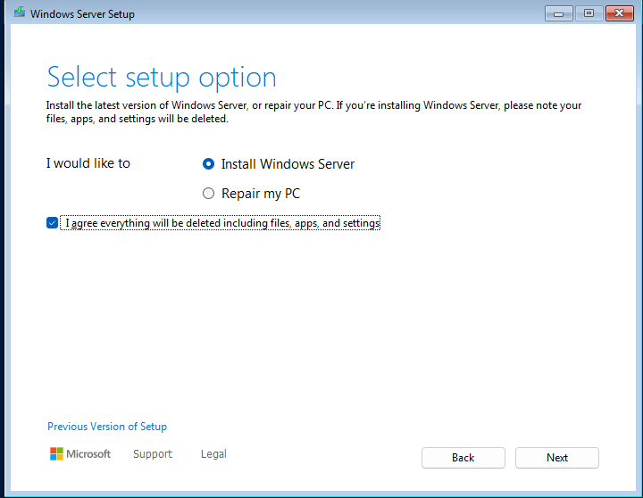

### 1.5 Seleciona la imtge
MOLT IMPORTANT, selecionar la imatge amb entorn gràfic,
i haceptem les lisencies

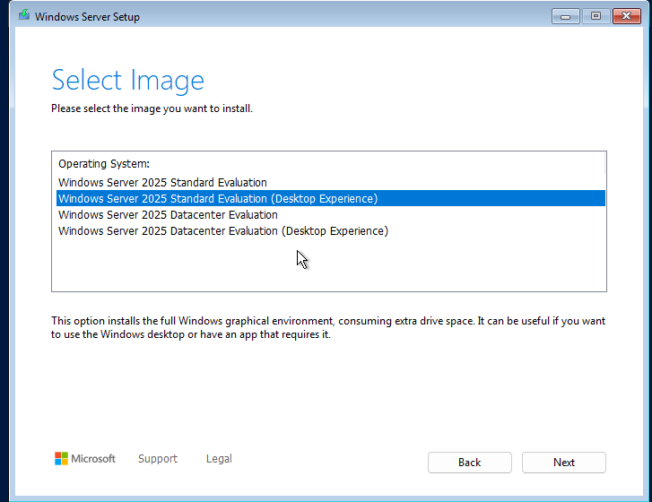

### 1.6 Selcionar el lloc de instalacio
Selecionar el disc on voleu instalar Windows server

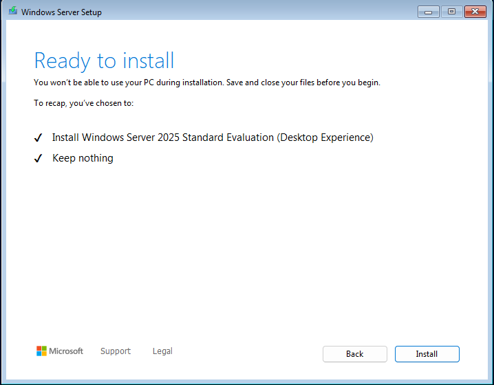

## final de la instalacio
Domes cal esperar a que es completi la instalacio

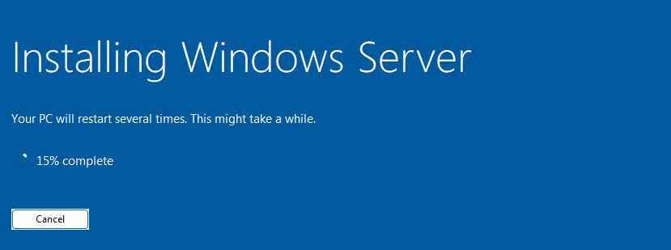

## 2 configuracio del servidor
### 2.1 Contrasenya dal administrador

Afeigim una contrasenya al nostra usuari de adiminstrador, A de ser complexa 

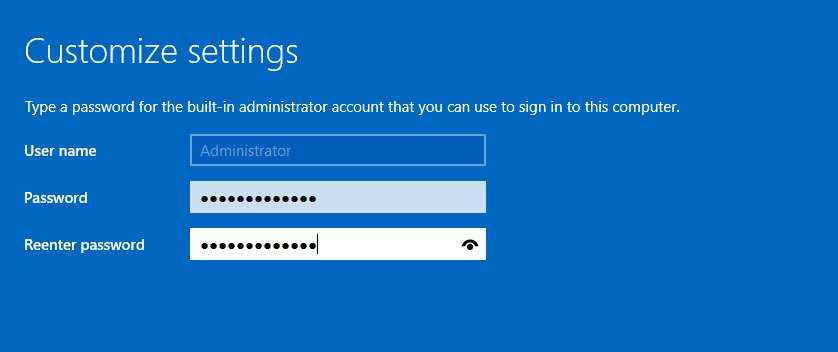

### 2.2 canviar el nom 
Es important cambiar el nom del equip per mes eficiencia

Li donem ha change

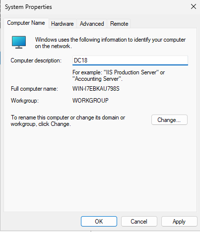

### 2.3 Configuracio de xarxa
El controlador de domini s' apuntar a ell mateix, 
utlitzarem la ip (127.0.0.1)

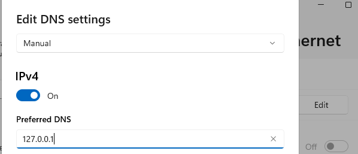

### 2.4 Intalacio del Rol Domine service
Lo primer que ferem es entrar a la part de Manager, I entrar hon diu add Roles and features

Segint d'l apartatde installation Type

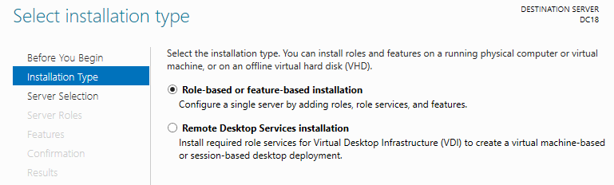

Next..

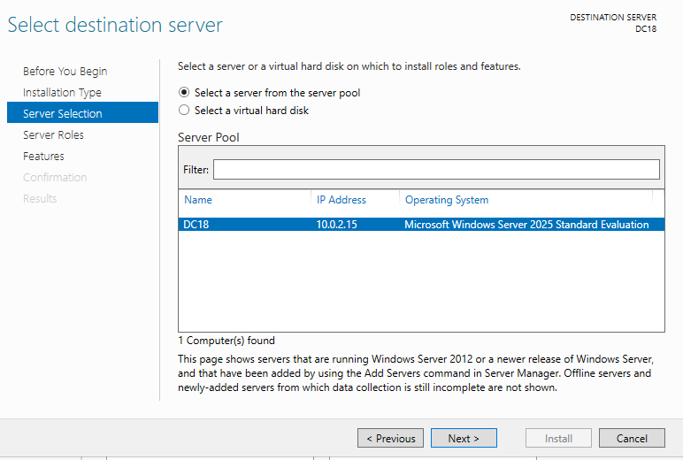

Permet Insta-lar roles de forma centrelitzada als diferents servidors del domini. 

Next...

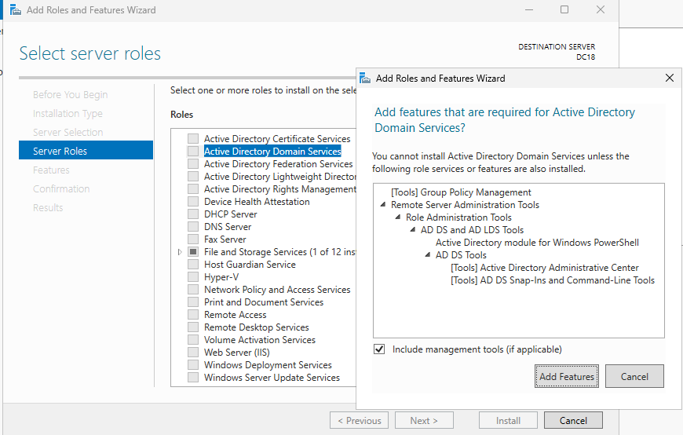

Next...

Confirmation...

INSTALL..

## 2.5 Promoció a domain controller

Entrem on diu Promote this server to a domain controller

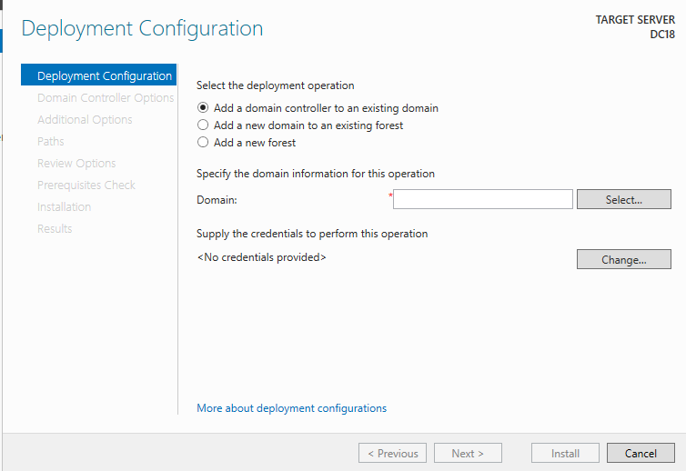

I selecionem el tipus de instalacio que volem fer,
Ens pregunta si volem afegir a undomini que ja existeix,

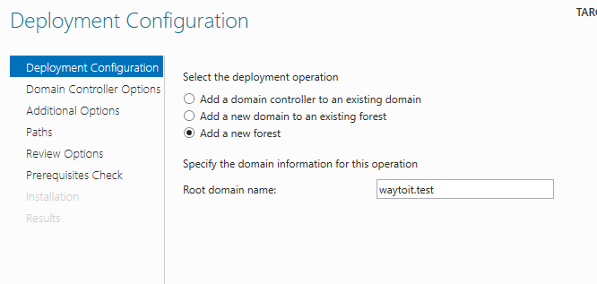

Next...

El nivell funcional de bosc i domini 