# Solució T08
## windos 11

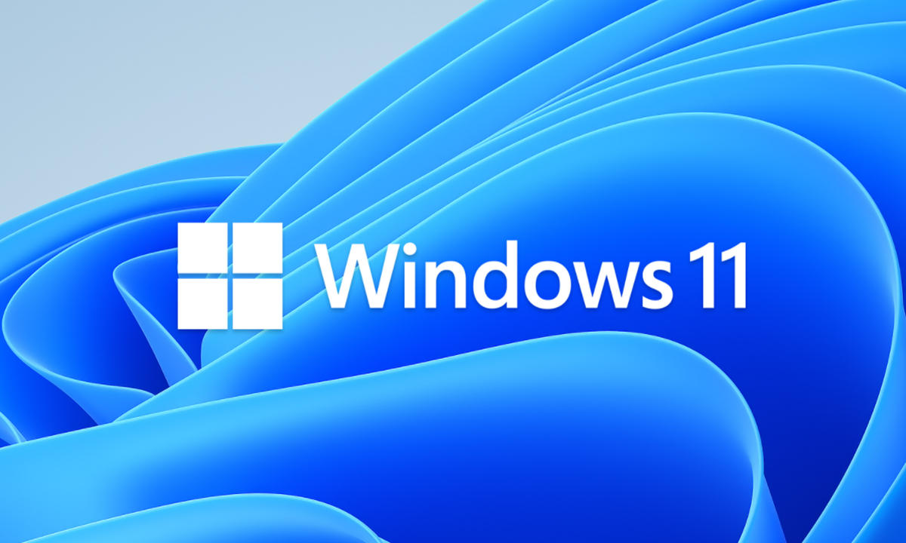

### Activitats

1. Seguiu les instruccions de l'enllaç que trobareu a https://www.eicar.org per a obtenir una còpia del test EICAR.

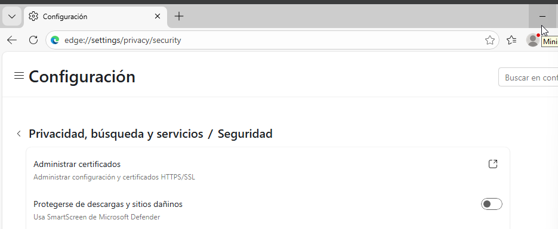

Pot ser que hagueu de desactivar de forma temporal el detector del navegador web i el de Windows per a poder baixar-lo. Expliqueu com es fa.

Activeu i comproveu si el detecta l'antimalware escollit.

2. Torneu a desactivar la detecció en temps real. Proveu ara a tornar a baixar i a amagar el virus EICAR dintre un arxiu comprimit en formats diferents. Podeu fer servir eines com winzip, winrar o 7zip per comprimir el fitxer. Torna a activar l'antimalware. Indica en cada cas si l'antimalware detecta l'amenaça:

 zip
 tar
 7zip

## Sistemes protecció Windows 11

1. Quines proteccions incorporar Windows 11 a la seccció de "Protección antivirus y contra amenazas"?

- Amenazas actuales

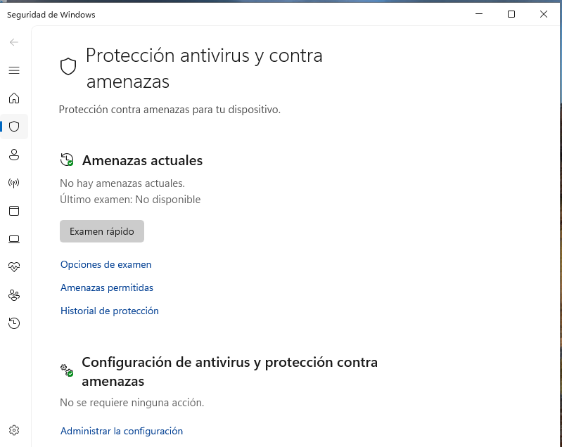

- Configuracion de antivirus y protecion contra amenazas 

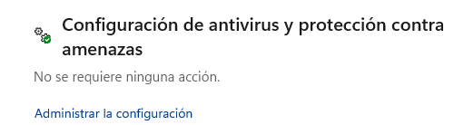

- Actualizaciones de protecion y contra amenazas

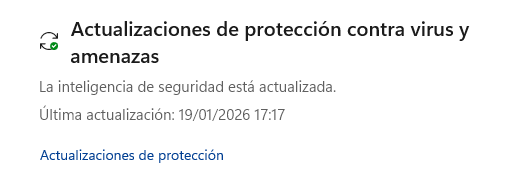

- Protección contra ransomware

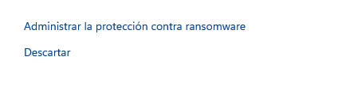

2. Quines opcions tenim a "Control de aplicaciones y navegador"?
Control de aplicaciones y navegador protege el sistema frente a apps maliciosas y sitios web peligrosos, bloqueando descargas y ejecuciones inseguras.
Ayuda a prevenir virus, phishing y ataques mientras navegas o instalas programas.

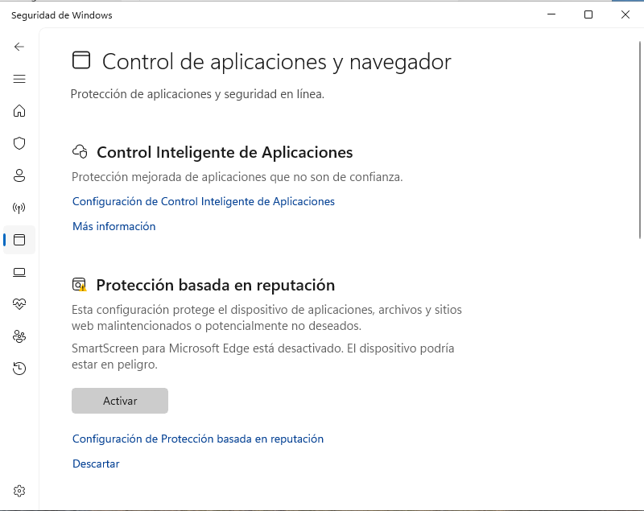


3. Investigueu 
La protección contra ransomware incluye acceso controlado a carpetas, que bloquea cambios no autorizados en archivos importantes.
También permite recuperar datos con OneDrive mediante copias de seguridad si ocurre un ataque.

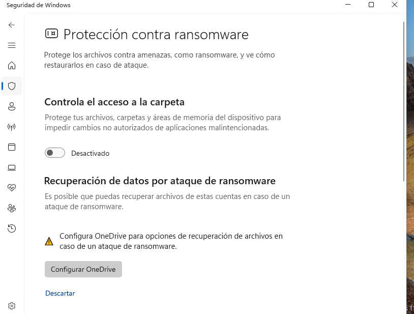

## Prova pràctica de protecció contra Ransomware

Ara comprovarem el funcionacionament específic de les proteccions contra ransomware, feu el següent:

1. Afegiu dins la carpeta "Documents" uns quants arxius TXT.

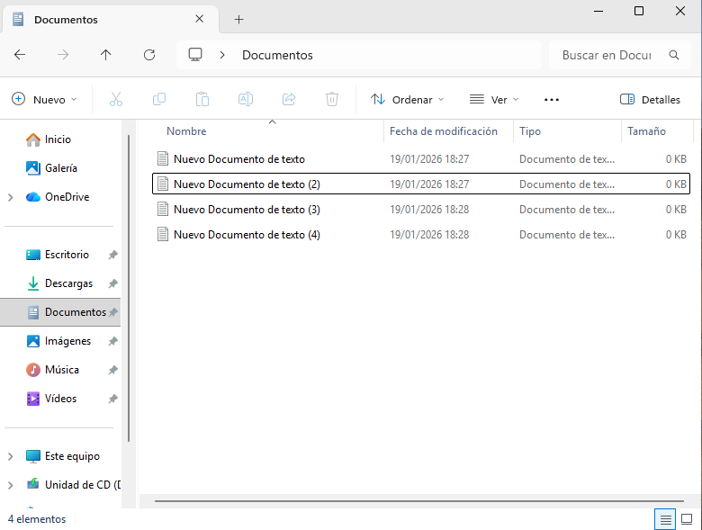

2. Desactiveu, si està activada prèviament, la protecció contra ransomware.

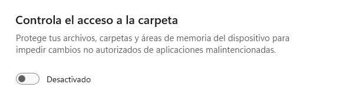


3. Descarregeu el fitxer de prova de ransomware de https://github.com/JoelGMSec/PSRansom. Es tracta d'un script de PowerShell que simula el comportament d'un ransomware. Com per defecte, Windows 11 restringeix l'execució d'scripts de PowerShell, haureu de canviar la política d'execució per permetre-ho, obrint una finestra de PowerShell com a administrador i executant la següent ordre:

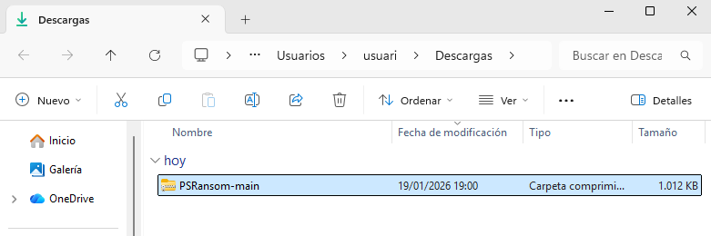

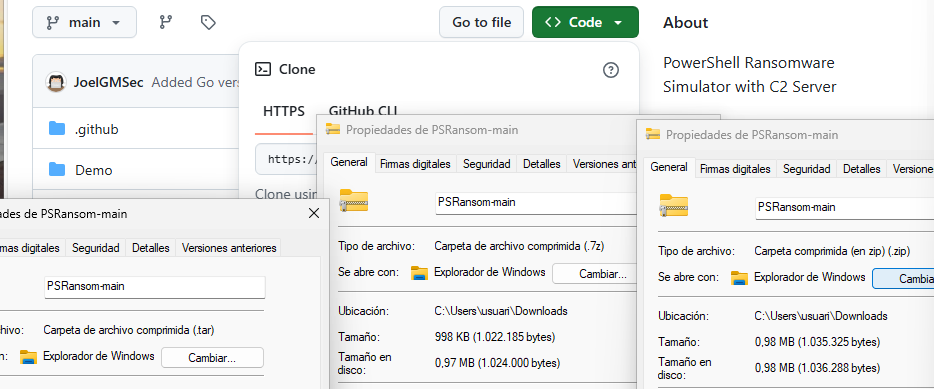

``` bash
Set-ExecutionPolicy -ExecutionPolicy unrestricted
```

4. Obre una consola de PoweShell a la carpeta on hagis descarregat l'script i executa'l amb la següent ordre:
``` bash
.\PSRansom.ps1 -e C:\Users\%USERNAME%\Documents -s 127.0.0.1 -p 80 -x


Atacs de Ransomware: WannaCry

Llegiu la informació sobre WannaCry https://www.avg.com/es/signal/wannacry-ransomware-what-you-need-to-know i busqueu informació als enllaços dels projectes antiransomware per contestar les preguntes següents:

Expliqueu quins són els factors que fan que WannaCry es propagui tan ràpid. Expliqueu què vol dir.

Quina vulnerabilitat en concret es fa servir? Busqueu el CVE associat. És molt greu?

S'ha de pagar el rescat demanat? Per què? Busqueu per internet a veure si trobeu alguna empresa negociadora de rescats i com funciona. Això s'està fent, tot i que no se sol recomanar...

Quines mesures podem aplicar si volem PREVENIR un atac de Ransomware abans que passi?

Quines mesures aplicarem si JA HEM SOFERT un atac de WannaCry i no hem aplicat les mesures de prevenció o ho hem fet parcialment?

Prova pràctica de WannaCry
ATENCIÓ: Els següent pas és perillós. Seguiu les instruccions de forma estricta.

MAI ho heu de fer amb un equip de producció (màquina física o de la feina o de les pràctiques). En cas contrari, es pot incórrer en delictes tipificats al codi Penal amb penes que poden suposar multes i fins i tot presó.

Es declina tota responsabilitat en el cas que aquesta informació sigui utilitzada amb finalitats il·lícites o delictives. També es declina tota responsabilitat en cas de destrucció total o parcial de dades per fer-ho en un entorn diferent de l'indicat.

Feu una instantània o snapshot de la màquina virtual, anomenada "Abans del virus".

Poseu alguns arxius reals (els podeu crear o baixar d'Internet)en una carpeta a dins de Documents:

Algun document de text (.txt)
Algunes imatges (.jpg, .png)
Algun documents de Word (.docx)
Algun arxiu PDF (.pdf)
Un fitxer comprimit amb els arxius anteriors (.zip)
Un fitxer compromit amb els arxius anteriors (.zip) però protegit amb contrasenya.
Descarregueu de https://github.com/ytisf/theZoo el malware de tipus Ranswomware "WannaCry".

Descomprimiu el .zip que està protegit amb contrasenya. L'antimalware no pot descomprimir el fitxer per mirar a dins perquè té contrasenya. La contrasenya és "infected". Un cop descomprimit, executeu el fitxer .exe de WannaCry i observeu què passa.

Comproveu si el vostre antimalware el detecta i quin missatge dóna.
Si no detecta res, mireu d'escanejar el fitxer amb botó dret, escollir opció analitzar.
Aneu amb compte, és un virus real.
Desactivem les proteccions en temps real de l'antimalware i tornem a descomprimir el fitxer.

Finalment, envieu un fitxer .ZIP que NO tingui contrasenya (si no no es pot escanejar) a https://www.virustotal.com i https://opentip.kaspersky.com/ per comprovar quins antivirus dels que prova detecten virus al fitxer i què detecten. Indiqueu quins són els que no ho fan.

Ara, a la màquina virtual, amb interfície de xarxa desconnectada, sense tenir cap carpeta compartida ni tenir Guest Additions:

Desactiveu l'antimalware
Executeu l'executable WannaCry.
Documenteu el missatge on es demana el rescat.
Comproveu quins fitxers s'han xifrat. Afecta a tots els fitxers o només a alguns tipus?
Un cop heu documentat aquesta part, apagueu la màquina virtual i torneu a l'instantània "Abans del virus".
