# t09 Vulnerabilitats

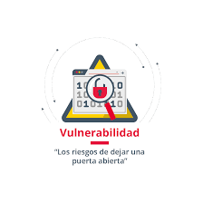

## 1 Crear las maquinas vulnerables 

Com a maquina vulnerable farem servir metasplitable, i com maquina escaner farem servir Openvas

.png)

## 2 Configuració de las maquinas 

Metasploit la deixem tal com esta i OpnesVas afeguim un HOS ONLY

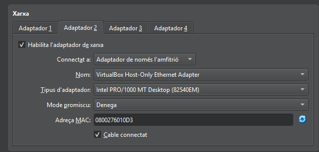

## ips de las maquines 

Lo primer sera  hacdeir a metasplit amb msfadmin/msfadmin
i fer un, ip a. 

Molt important!!, ens quedem amb la ip

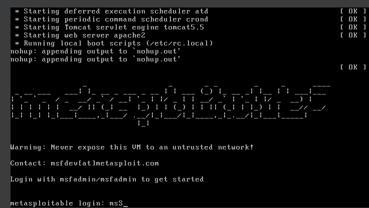

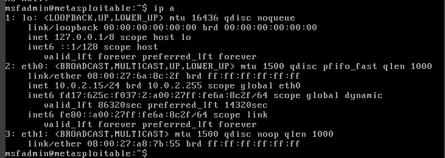

Hara configurarem OpenVas entrant a la maquina i configurarle, entrem amb admin/admin.

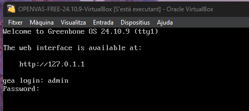

Quan estem dintre haurem de afegir un usuari (usuari/usuari).

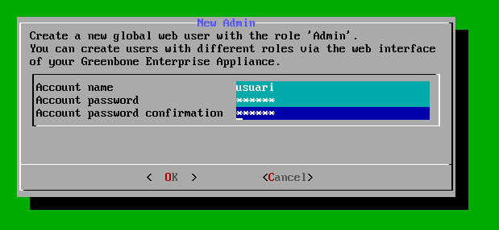

Despues hem de accedir a la configuració de networks i activar el ipV4. 

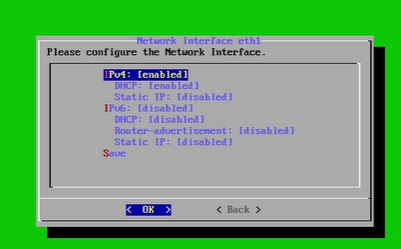

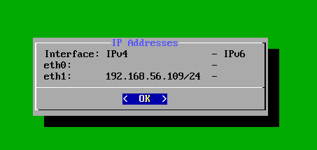

Molt importrant quedarnos amb la ip. 

## 4 Scan

Lo primer sera accedir via web a Openvas amb la ip de la maquina anterior. 

Entrarem amb el usuari que hem afegit avans

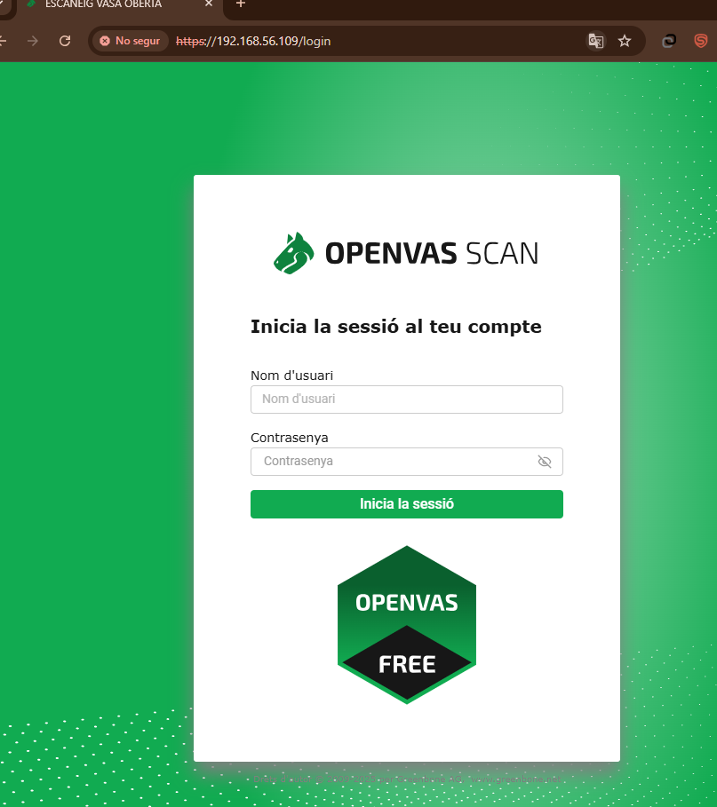

Quan estem dintre Veurem aquest menu 

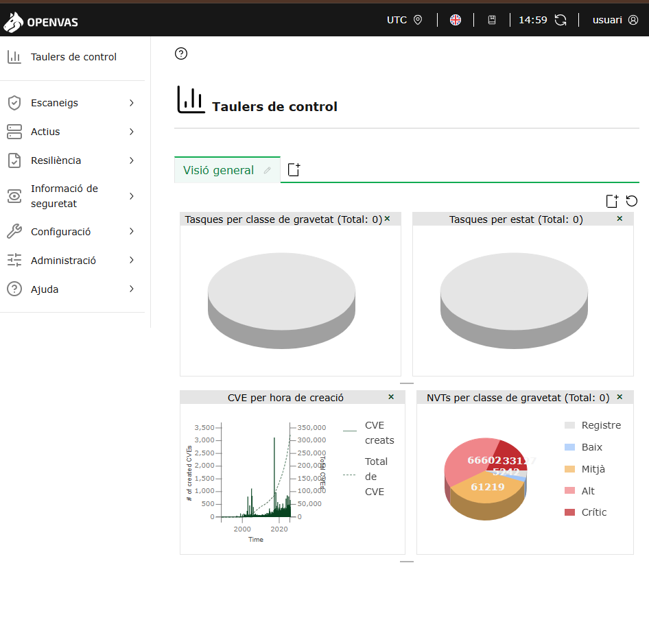

Haurem de entrar  a l' apartat d'anfritions en Actius.

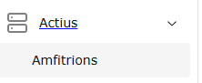

Alla Afegim un nou amfritio, on haurem deposar un nom y la ip del metasplitable uqe ens hem guardat avans.

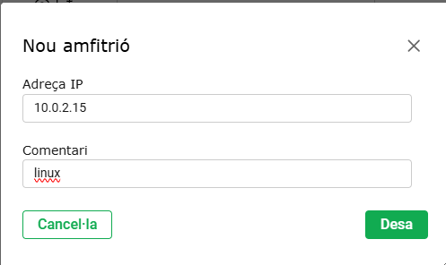

Hara em de fer el obejtiu jo li posare linux vulnerable 4, important que poser dels recursos del ambritio,

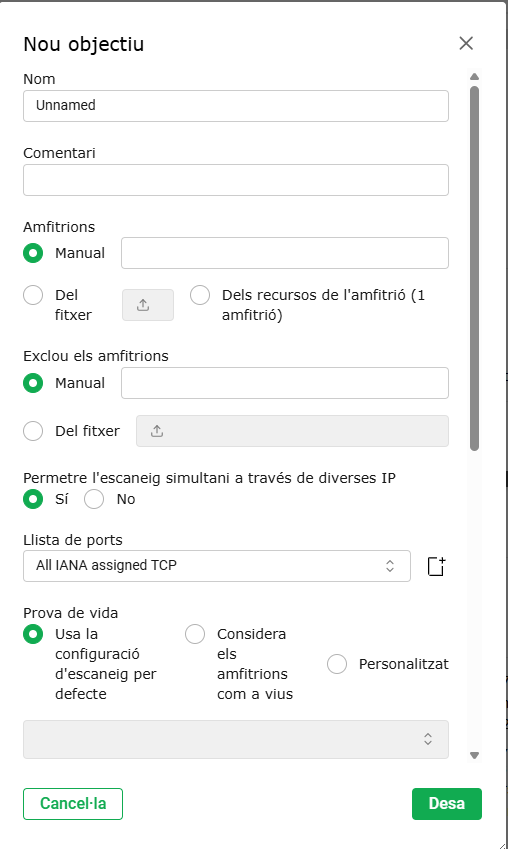

Tmabe em de afegir un fitxer ssh, es inportant afegir una contraseña i marcar los dues opcions com a NO.

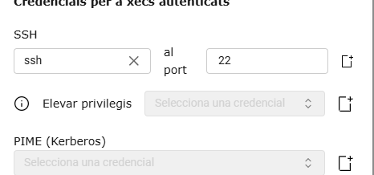

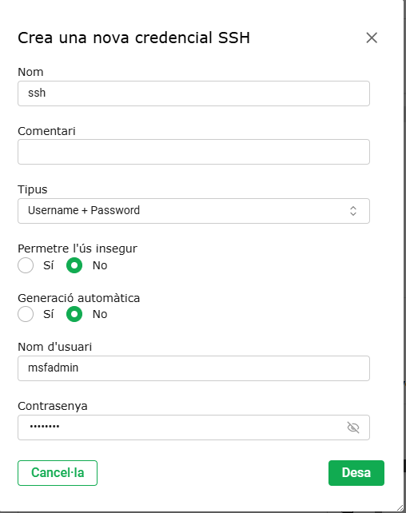

Hara crehem una tasca nova, jo li poso el nom del afritio (linux vulnerable 4).

A qui haurem de marcar com a obextiu el amritio de avasns

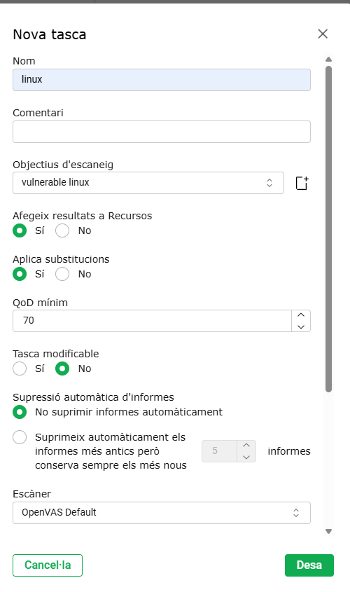