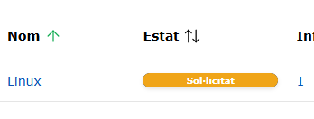
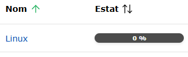
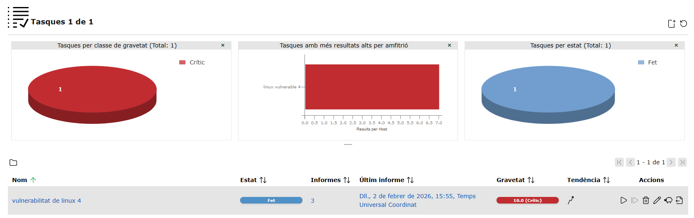
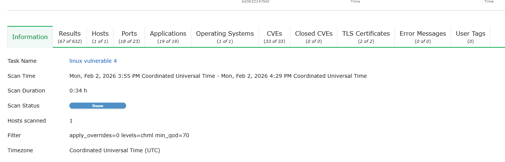
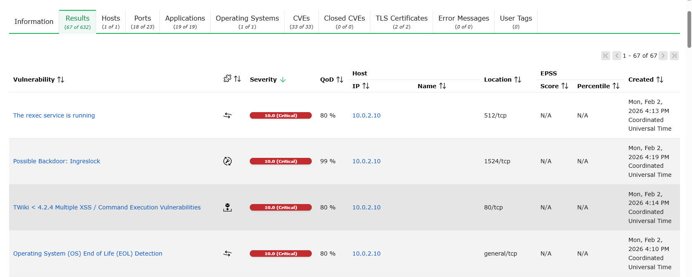
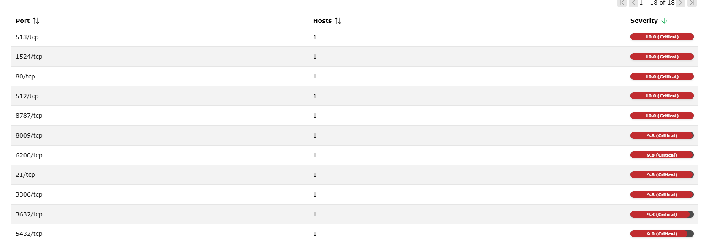

# t09 Vulnerabilitats

## 1 Crear las maquinas vulnerables 

Com a maquina vulnerable farem servir metasplitable, i com maquina escaner farem servir Openvas

.png)

## 2 Configuració de las maquinas 

Metasploit la deixem tal com esta i OpnesVas afeguim un HOS ONLY

## ips de las maquines 

Lo primer sera  hacdeir a metasplit amb msfadmin/msfadmin
i fer un, ip a. 

Molt important!!, ens quedem amb la ip

Hara configurarem OpenVas entrant a la maquina i configurarle, entrem amb admin/admin.

Quan estem dintre haurem de afegir un usuari (usuari/usuari).

Despues hem de accedir a la configuració de networks i activar el ipV4. 

Molt importrant quedarnos amb la ip. 

## 4 Scan

Lo primer sera accedir via web a Openvas amb la ip de la maquina anterior. 

Entrarem amb el usuari que hem afegit avans

Quan estem dintre Veurem aquest menu 

Haurem de entrar  a l' apartat d'anfritions en Actius.

Alla Afegim un nou amfritio, on haurem deposar un nom y la ip del metasplitable uqe ens hem guardat avans.

Hara em de fer el obejtiu jo li posare linux vulnerable 4, important que poser dels recursos del ambritio,

Tmabe em de afegir un fitxer ssh, es inportant afegir una contraseña i marcar los dues opcions com a NO.

Hara crehem una tasca nova, jo li poso el nom del afritio (linux vulnerable 4).

A qui haurem de marcar com a obextiu el amritio de avasns

Quan tinguem la tasca feta la iniciem, pot tardar bastant de temps 

## 5 Informa 
L’escaneig del sistema 10.0.2.10 ha detectat vulnerabilitats crítiques que posen en risc alt la seguretat. S’han identificat serveis insegurs en execució, una possible backdoor (Ingreslock), vulnerabilitats d’execució remota de comandes, i un sistema operatiu fora de suport (EOL). El servidor també presenta diversos ports crítics oberts, incrementant l’exposició.
En conjunt, el risc és molt elevat i es recomana actuar de manera immediata: tancar serveis i ports insegurs, actualitzar el sistema operatiu, aplicar pegats i comprovar si hi ha hagut compromís del sistema.

## 6 vulnerabilitats 

1. Possible Backdoor: Ingreslock (port 1524/tcp)
Indica la presència d’un servei associat habitualment a accessos il·legítims. Pot significar que el sistema hagi estat compromès o que un atacant hagi deixat una porta d’entrada.

2. TWiki < 4.2.4 – Execució remota de comandes
Una vulnerabilitat que permet a un atacant executar comandes al servidor de forma remota a través de la web, prenent control total del sistema.

3. Sistema Operatiu en Fi de Vida (EOL)
El sistema operatiu ja no rep actualitzacions de seguretat ni pegats. Qualsevol vulnerabilitat coneguda queda exposada i fàcilment explotable.